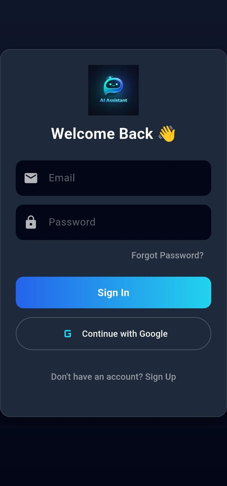
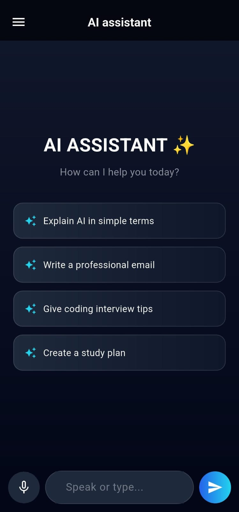
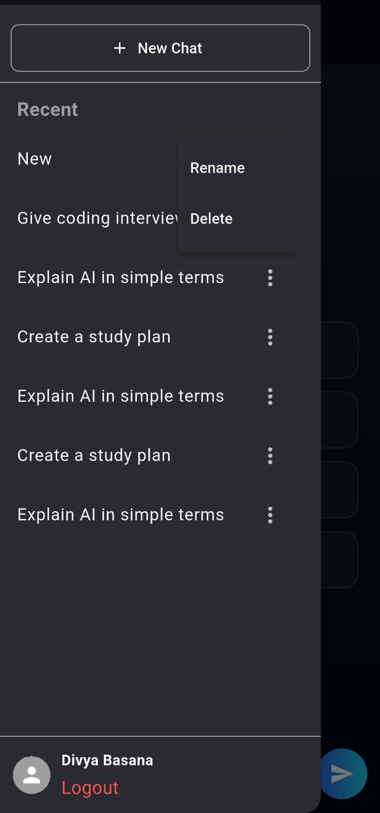
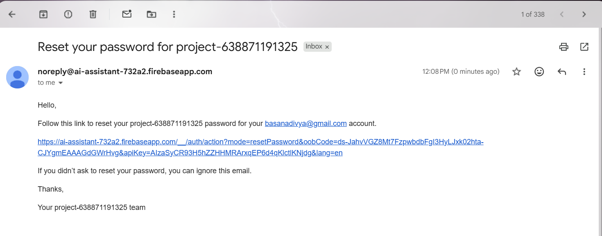
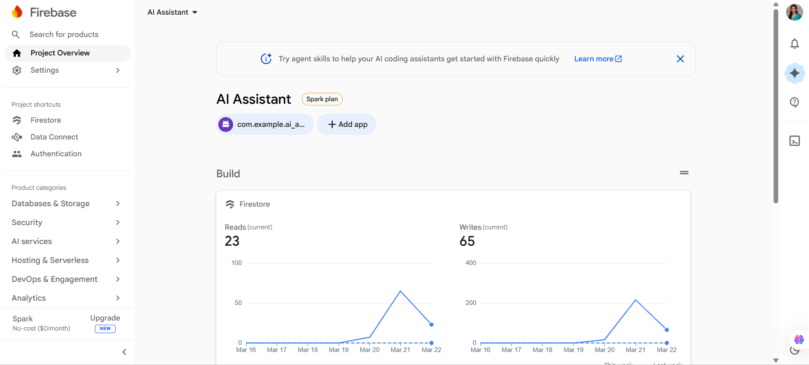
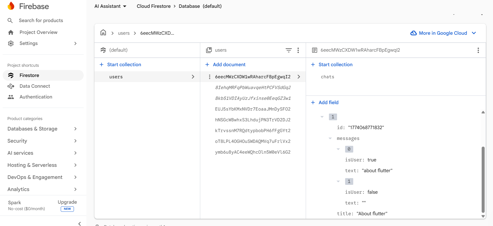
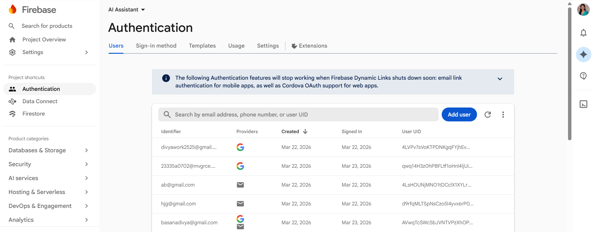

# 🤖 AI Assistant Mobile App (Flutter)

An intelligent AI-powered mobile assistant application built using **Flutter**, designed to provide real-time conversational support through both **text and voice input**. The app integrates external AI APIs to generate meaningful responses and uses Firebase for secure user authentication.

---

## 📱 Overview

This application acts as a **smart personal assistant**, allowing users to interact using either typing or speaking. The app converts voice input into text, processes it using an AI API, and delivers intelligent responses through a chat-based interface.

---

## 🚀 Key Features

* 💬 **Real-Time Chat Interface**
  Interactive chat UI with user and AI message bubbles

* 🎤 **Voice Input (Mic Feature)**
  Speak instead of typing using speech-to-text

* 🤖 **AI Integration (API-Based)**
  Generates intelligent responses using external AI API

* 🔐 **Firebase Authentication**
  Secure login and registration system

* ⚡ **State Management (Provider)**
  Efficient handling of chat messages and UI updates

* 🎨 **Modern UI Design**
  Clean, responsive, and user-friendly interface

---

## 🛠️ Technologies Used

* **Flutter** – Cross-platform UI development
* **Dart** – Programming language
* **Provider** – State management
* **REST API** – AI communication
* **HTTP Package** – API requests
* **Firebase Authentication** – User management
* **Speech-to-Text** – Voice input processing

---

## 🏗️ System Architecture

The app follows a **layered architecture**:

* 📱 Presentation Layer → UI Screens & Widgets
* 🎤 Speech-to-Text Layer → Voice Processing
* 🧠 State Management → Provider
* 🔌 Service Layer → API Integration
* 📦 Data Layer → Models

---

## 🔄 API Flow

User Input (Text / Voice)
→ Speech-to-Text
→ Chat Provider
→ API Service
→ AI API
→ Response
→ UI Update

---

## 📂 Project Structure

```
lib/
 ├── screens/        # UI screens (Login, Chat, Home)
 ├── widgets/        # Reusable UI components
 ├── providers/      # State management
 ├── services/       # API integration
 ├── models/         # Data models
```

---

## 🔧 Setup Instructions

### 1️⃣ Clone the Repository

```bash
git clone https://github.com/Divya-Basana/ai-assistant-app.git
cd ai-assistant-app
```

### 2️⃣ Install Dependencies

```bash
flutter pub get
```

### 3️⃣ Firebase Setup

* Create a Firebase project
* Download `google-services.json`
* Place it in:

```
android/app/
```

### 4️⃣ Run the App

```bash
flutter run
```

---

## 📸 Screenshots

                
---

## 🎯 Use Case

* Smart assistant for answering queries
* Hands-free interaction using voice
* Demonstration of AI + Flutter integration

---

## 🔮 Future Enhancements

* 🔊 Text-to-Speech (AI voice replies)
* 🌐 Multi-language support
* 🧠 Personalized responses
* 🌙 Dark mode

---

## 👩‍💻 Author

**Divya Basana**
B.Tech - Computer Science & Information Technology

---

## ⭐ Acknowledgements

* Flutter by Google
* Firebase
* AI API services

---

## 📌 License

This project is developed for academic and learning purposes.
